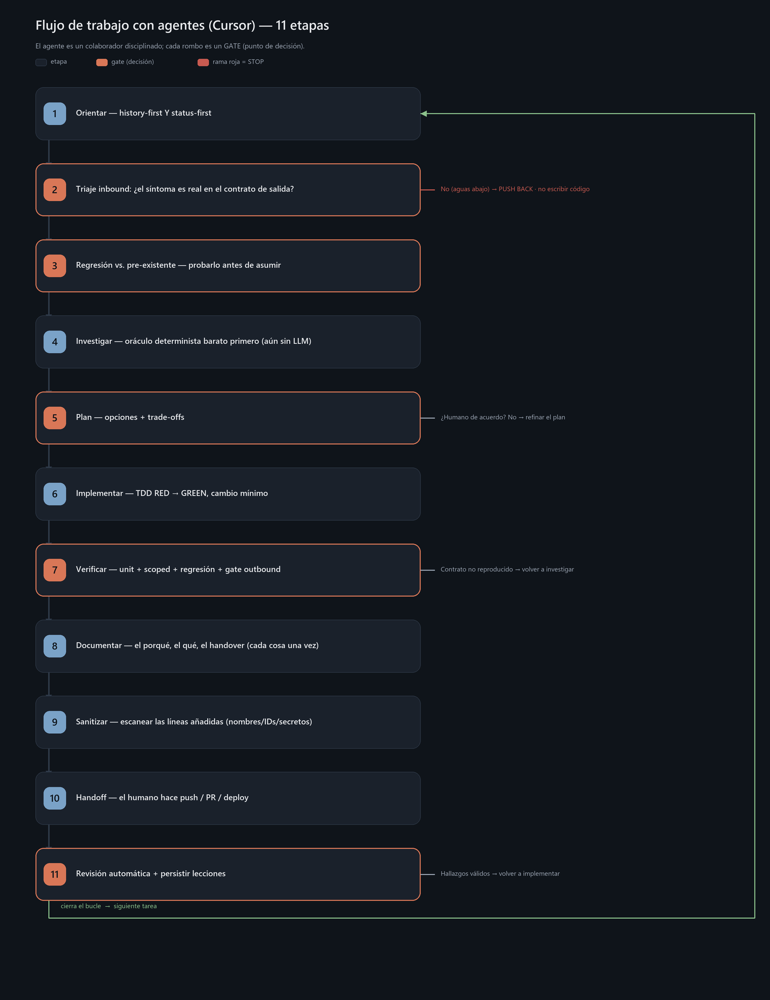

# Cursor — Guía de presentación (curso en tres partes)

> Guía narrativa para el curso/workshop. Está pensada para el/la **ponente**: cada sección mapea a un
> bloque de slides del deck ([`presentacion/`](./presentacion/)) e incluye el hilo a contar,
> los puntos clave y una frase de cierre 🗣️ lista para la diapositiva. Audiencia: **técnica /
> desarrolladores**. Es el **volumen Cursor** del curso — contrapartida directa de
> [`GUIA_PRESENTACION.md`](https://github.com/olonok69/claude_code_ml_engineer/blob/HEAD/GUIA_PRESENTACION.md)
> (Claude Code, repo hermano), misma estructura y numeración de secciones.
>
> El deck es **una sola presentación** con **tres partes diferenciadas**:
> - **Parte 1 — Cursor:** la herramienta, del editor en tu escritorio a agentes en la nube.
> - **Parte 2 — La metodología:** cómo se trabaja de verdad con un agente en producción. Es **agnóstica
>   de la herramienta** — se demuestra con Cursor, pero nació en Claude Code y viaja entre ambos
>   (sección 10, el ejemplo más real del curso).
> - **Parte 3 — El grafo de conocimiento de tickets:** el mismo caso completo construido con **graphify**
>   que en el volumen Claude Code — el pipeline se generó allí, pero las skills `kg`/`kg-refresh` son el
>   **mismo `SKILL.md`** y funcionan igual desde Cursor.
>
> El detalle de implementación (configs, código copy-paste) está en
> [`GUIA_TECNICA.md`](./GUIA_TECNICA.md) y en [`ejemplos/`](./ejemplos/). La
> carpeta [`docs/`](./docs/) es material de referencia de una instalación real donde se aplica la
> metodología a diario. **Demos live por slide:** [`DEMO_RUNBOOK.md`](./DEMO_RUNBOOK.md).
>
> **Nota de verificación (2ª revisión):** el contenido específico de Cursor (Skills, Marketplace,
> Subagents, CLI headless, hooks, SDK…) se verificó contra `docs.cursor.com` el **9 de agosto de 2026**.
> Cursor cambia rápido — antes de dar el curso, revisa si algo se ha vuelto a mover.

---

## Índice

**Parte 1 — Cursor**

0. [Qué es Cursor (encuadre)](#0-qué-es-cursor)
1. [Instalación y uso básico](#1-instalación-y-uso-básico)
2. [Memoria, instrucciones y sesiones](#2-memoria-instrucciones-y-sesiones)
3. [Contexto: context window y prompt caching](#3-contexto)
4. [MCP — conectar tus herramientas](#4-mcp)
5. [Skills y Marketplace](#5-skills-y-marketplace)
6. [Subagents](#6-subagents)
7. [Automatización](#7-automatización)

**Parte 2 — La metodología (agnóstica)**

8. [La metodología: principio, flujo y ejemplo real](#8-la-metodología)
9. [Las herramientas del método: CodeGraph, Serena, GSD…](#9-las-herramientas-del-método)
10. [Transferir la metodología: de Claude Code a Cursor](#10-transferir-la-metodología)
11. [Sincronización de máquinas (tarball + S3)](#11-sincronización-de-máquinas)

**Parte 3 — El grafo de conocimiento de tickets (graphify)**

12. [El grafo de conocimiento de tickets](#12-el-grafo-de-conocimiento-de-tickets)
13. [Cierre](#13-cierre)

---

# PARTE 1 — Cursor

## 0. Qué es Cursor

**Hilo:** Cursor es un editor de código con un agente integrado que **lee tu codebase, edita ficheros,
ejecuta comandos** y se integra con tus herramientas — nace como fork de VS Code, pero el salto real no
es el editor: es el agente. No es autocompletado: entiende el proyecto entero y trabaja a través de
varios ficheros y tools. Y el mismo agente vive en tres superficies: el **editor**, la **CLI** (`agent`)
y la **nube** (Background/Cloud Agents) — tus `AGENTS.md`, rules y servers MCP funcionan en las tres.

**Qué puedes hacer con él (los titulares):**
- Automatizar lo tedioso: escribir tests, arreglar lint, resolver conflictos de merge, actualizar deps.
- Construir features y arreglar bugs describiendo en lenguaje natural (Agent mode), con Plan mode antes.
- Bugbot revisa cada PR automáticamente en GitHub/GitLab/Bitbucket, sin script propio.
- Conectar tus herramientas con MCP; correr headless en pipelines Unix; programar con Automations.

🗣️ *"No es un autocompletado que sugiere líneas: es un colaborador que planifica, edita en varios ficheros y verifica — y encima vive en la nube cuando hace falta."*

---

## 1. Instalación y uso básico

**Hilo:** Instalar es trivial — el editor se descarga en un clic. Lo importante es entender que hay
**tres formas de entrar** (editor, CLI, nube) y **dos modos** de trabajar dentro de ellas.

**Instalación:**
```bash
# Editor: descarga desde cursor.com (macOS / Windows / Linux)

# Cursor CLI (agent) — headless-capable
# macOS / Linux / WSL:
curl https://cursor.com/install -fsS | bash
# Windows PowerShell:
irm 'https://cursor.com/install?win32=true' | iex
```
Luego, en cualquier proyecto:
```bash
cd tu-proyecto
agent             # CLI interactiva; primera vez: agent login (o CURSOR_API_KEY)
```

**Los dos modos (la idea que hay que dejar clara):**
- **Interactivo** — editor (chat / Agent mode) o CLI `agent`. Aquí vive el **Plan mode**: Cursor propone
  un plan antes de tocar nada y tú lo apruebas.
- **Headless (`agent -p` / `--print`)** — un prompt, resultado por stdout. Para scripts y CI; combina con
  `--force` si debe aplicar edits, y con `--output-format text|json` según el consumidor:
  ```bash
  agent -p --trust "resume los cambios de esta rama"
  agent -p --trust --output-format text "revisa por seguridad los ficheros tocados vs main"
  # Contenido de un log: pásalo en el prompt o referencia el fichero (no asumas pipe stdin→prompt)
  agent -p --trust "Lee app.log (últimas ~200 líneas) y avísame si ves anomalías"
  # --trust: primera vez en un workspace (o usa agent login + confiar en interactivo)
  ```

**Superficies:** editor (chat + Agent mode + Plan mode, diffs inline), Cursor CLI (`agent` en terminal —
ideal para SSH/servers), Background/Cloud Agents (`cursor.com/agents`, tareas async en la nube sin editor
abierto), Bugbot (revisión de PR automática).

🗣️ *"Interactivo para pensar contigo; `agent -p` para meterlo en scripts y CI. El mismo Cursor, tres superficies."*

---

## 2. Memoria, instrucciones y sesiones

**Hilo:** El agente es tan bueno como el contexto que le das — y como lo **gestionas**. Tres piezas:
`AGENTS.md` + rules, permisos, y las Memories de Cursor (un sistema aparte).

### `AGENTS.md` + `.cursor/rules/*.mdc` — la memoria del proyecto
`AGENTS.md` en la raíz es el fichero de orientación siempre cargado (admite ficheros anidados por
subcarpeta: gana el más específico). Los gates obligatorios y la prevalencia de tools viven además en
`.cursor/rules/*.mdc` con `alwaysApply: true`. Ahí van estándares de código, decisiones de arquitectura,
comandos y checklists.

**El error clásico y cómo lo resuelvo — patrón de dos niveles (idéntico en espíritu a Claude Code):**
- **Nivel 1 (siempre cargado):** pequeño. Solo orientación + **punteros de una línea**.
- **Nivel 2 (bajo demanda):** el detalle en ficheros que el agente lee solo cuando hace falta.
- Regla *write-once*: cada dato se escribe en un único sitio; `AGENTS.md`/rules llevan el puntero, no la copia.
- Mismo objetivo de recorte que en el proyecto Claude Code original (~73% sin perder información).
  (Ejemplo sanitizado en [`ejemplos/agents-md/`](./ejemplos/agents-md/).)

**Rules — el mecanismo que no tiene equivalente 1:1 en `CLAUDE.md`:** ficheros `.mdc` con frontmatter
(`description`, `globs`, `alwaysApply`) y **cuatro modos**: Always Apply, Apply Intelligently, Apply to
Specific Files, Apply Manually. Dentro de una rule, `@fichero` incluye contenido de otro fichero al
cargarla (eager) — **esta sintaxis no existe en `AGENTS.md`**, solo en `.mdc`.

### Permisos
`~/.cursor/permissions.json` (y `<repo>/.cursor/permissions.json`) define allowlists con campos
**`mcpAllowlist`** y **`terminalAllowlist`** — entradas `server:tool` con glob (`codegraph:*`,
`*:search`). Cuando el fichero define una clave, **sustituye** el allowlist de la UI para ese tipo.
Es la misma postura que en Claude Code — "el humano es dueño de las acciones externas" — reforzada con
rules ("no push sin pedir") + approvals de la UI + hooks (`beforeShellExecution` para vetar por
contenido). La CLI tiene su propio sistema de permisos (`cli-config.json`), aparte del IDE.

### Memories — un sistema DISTINTO
Cursor genera **Memories** automáticamente a partir de tus chats — no son ficheros que tú escribes, y
**no es el mismo mecanismo** que la auto-memory de Claude Code. Trátalas como complemento, no como
sustituto del patrón de dos niveles: no dejes de mantener `AGENTS.md`/rules pensando que las Memories lo
cubren.

### Sesiones que viajan
Mismo agente, misma configuración, en editor, CLI y Background/Cloud Agents (`cursor.com/agents`, sigues
el progreso desde la web). Bugbot corre solo en cada PR, sin invocarlo.

🗣️ *"El `AGENTS.md` que se carga siempre debe ser una onboarding de 30 segundos, no un vertedero. Punteros, no copias — y las Memories son otra cosa."*

---

## 3. Contexto

**Hilo:** Aquí está la sección que explica **por qué** el patrón de dos niveles de la sección anterior no
es manía: el context window es el recurso que gobierna rendimiento **y** coste. Dos mitades: gestionarlo
(context window) y entender qué se puede/no se puede controlar del caching en un producto que no expone
la API directamente. Material: [`ejemplos/context/`](./ejemplos/context/) y
[`ejemplos/prompt-caching/`](./ejemplos/prompt-caching/).

### 3a. Context window — el recurso que gobierna todo

**Qué lo llena antes de que escribas nada:** el system/agent prompt (oculto, siempre primero), las rules
`alwaysApply` + `AGENTS.md` (lo controlas tú — por eso el patrón de dos niveles), las Memories si las hay
(sistema distinto, revisa qué se coló), el índice de tools MCP, y luego conversación, ficheros leídos,
output de comandos (crece cada turno).

**Los mandos:**
- Anillo de contexto del editor — visualiza el uso por bloque. Mide antes de optimizar.
- Nueva chat / sesión limpia — reset entre tareas no relacionadas (en CLI: nueva invocación de `agent`).
- `/rewind` — volver a un mensaje previo (CLI; habilitable en config).
- `/summarize` (alias `/compress`) — resumir y liberar contexto manualmente.
- Cursor **resume automáticamente** al acercarse al límite — no asumas paridad exacta con `/compact` de
  Claude Code; el mecanismo es distinto aunque el objetivo sea el mismo.

**Higiene que aplicamos de verdad:** `AGENTS.md`/rules mínimos (dos niveles); `@fichero` en rules solo si
hace falta (carga *eager*, úsalo con cuidado); MCP con moderación (cada server suma su bloque de tools);
Subagents para investigar (sección 6) para que el ruido no viva en tu sesión; Plan mode antes de Agent
mode para separar exploración de implementación; lecturas con puntería en vez de "entiende todo el auth".

### 3b. Prompt caching — qué es de la API, y qué controlas en el producto

**El mecanismo (API de Anthropic, no de Cursor):** cada turno reenvía TODO el contexto. La API cachea el
**prefijo estable** (orden estricto: `Tools → System → Messages`): escribir cache cuesta 1.25× (2× a 1h
de TTL), **leerlo cuesta 0.1×**. Una sesión de 50 turnos relee el prefijo 50 veces a precio de saldo. Esto
es de la API de Anthropic — pero si automatizas con la **Cursor SDK** contra Claude, aplica igual.

**En el producto Cursor no tienes ese mando expuesto** (no hay env vars como en Claude Code, ni
`cache_control` visible) — aplica lo que decida el proveedor del modelo por debajo. Lo que sí controlas:

- `AGENTS.md` + rules pequeños y **estables** → prefijo que no cambia entre turnos → mejor comportamiento.
- Editar rules/`AGENTS.md` a mitad de sesión → paga impuesto de nuevo.
- Muchos servers MCP activos → bloque de tools grande y cambiante → más contexto fijo.
- Nueva sesión / chat limpio entre tareas no relacionadas → evita arrastrar transcript infinito.
- No asumas que Cursor expone `cache_control` como la API — es un producto distinto; no copies las env
  vars de Claude Code (`ENABLE_PROMPT_CACHING_1H`, etc.), no existen aquí.

Demo ejecutable con la API directa (para entender el mecanismo, no el producto):
[`ejemplos/prompt-caching/cache_demo.py`](./ejemplos/prompt-caching/cache_demo.py).

**El puente que une 3a y 3b (y adelanta la Parte 2):** contexto lean y estable **rinde mejor en cualquier
producto**, aunque no veas el descuento en pantalla. Y la "prevalencia de tools" de la metodología
(CodeGraph antes que leer ficheros) es, en el fondo, política de contexto: máxima señal por token.

🗣️ *"El context window es tu presupuesto en cualquier agente; el prompt caching es API, no producto — pero lean y estable gana en los dos."*

---

## 4. MCP

**Hilo:** **MCP (Model Context Protocol)** es el mismo estándar abierto que en Claude Code — CodeGraph,
Serena y Playwright hablan MCP en ambos productos. Lo único que cambia es dónde vive la configuración.

**Los dos scopes (dónde vive la config):**
- **project** → `.cursor/mcp.json` en la raíz, **versionado**, compartido con el equipo.
- **user** → `~/.cursor/mcp.json` — editable **directamente** (o vía Settings → MCP en el editor).

**Añadir uno** (edición manual del JSON — no hay comando `agent mcp add`):
```jsonc
// .cursor/mcp.json
{ "mcpServers": { "serena": {
    "command": "uvx", "args": ["--from", "git+https://github.com/oraios/serena", "serena", "start-mcp-server"] } } }
```
Tras editar `.cursor/mcp.json`: **recarga/reinicia Cursor** — no hay hot-reload.

**Los que uso a diario (los 5 de la Parte 2):** `codegraph` (grafo del código), `serena` (navegación
semántica), `playwright` (UI / contrato en navegador), `context7` (docs de librerías al día), y la skill
**`kg`** (grafo de tickets vía scripts en el repo — no es un server MCP). `supabase` es solo un ejemplo
opcional de MCP + secreto por env var — **no** es obligatorio para el curso.

**Verificación en el repo demo (ILS):** checklist completa para que un agente configure e instale las 5
tools y las smoke-teste →
[`docs/ai-agents-code-methodology/AGENT_SETUP_TOOLS.md`](./docs/ai-agents-code-methodology/AGENT_SETUP_TOOLS.md)
y, en el repo vivo, `document-parser-lambda/AGENT_SETUP_TOOLS.md`. Resumen: abrir **ese** repo en Cursor
(no solo el workspace padre), pin correcto de CodeGraph `--path`, `codegraph` en PATH + **reload**,
MCP en verde, luego un prompt de prueba por tool.

**Buenas prácticas:** secretos por variable de entorno (nunca en el JSON versionado); el server disponible
≠ tool permitida (`permissions.json` sigue controlando el acceso); y — enlaza con la sección 3 — **cada
server suma contexto**: desactiva los que el proyecto no use. Config de ejemplo en
[`ejemplos/mcp/`](./ejemplos/mcp/).

**La distinción que hay que dejar clara:** los servers **no se instalan en `AGENTS.md`** — ese fichero es
prompt, no configuración. `.cursor/mcp.json`/`~/.cursor/mcp.json` (o un pack del repo) dan la
**capacidad**; `AGENTS.md`/rules dan el **criterio** — el *trigger map* que hace que el agente tire de la
tool correcta sin que se lo pidas ("CodeGraph antes de leer ficheros enteros"). Instalar convierte "no
tengo la tool" en "la tengo"; las rules convierten "la tengo" en "se usa en el orden correcto" (es la
prevalencia de la Parte 2).

🗣️ *"MCP convierte a Cursor de 'sabe de código' a 'sabe de TU sistema': tus docs, tus tickets, tu navegador — el mismo estándar que en Claude Code."*

---

## 5. Skills y Marketplace

**Hilo:** Esta es la sección donde el curso Cursor y el original divergen más — y donde converge de
vuelta. Cuando se escribió la primera guía de adaptación a Cursor, **ni Skills ni Marketplace existían**
en el producto. Hoy ambos son reales, y una de las dos capacidades ya no es una brecha con Claude Code:
es literalmente el **mismo fichero**.

1. **Tools** — lo que el agente puede *hacer*: Read/Edit/Shell/Grep + Task + `mcp__*`. Gobernadas por
   `permissions.json`.
2. **Skills** — `.cursor/skills/<n>/SKILL.md` con frontmatter `name` + `description`; el agente la
   **auto-selecciona** por esa descripción, igual que en Claude Code.
3. **Interop directa con Claude Code:** Cursor también lee `.claude/skills/` — el **mismo `SKILL.md`**
   sirve en los dos productos sin traducir nada. Es la base de por qué las skills `kg`/`kg-refresh` de la
   Parte 3 funcionan igual aquí.
4. **Marketplace** (`cursor.com/marketplace`) — paquetes instalables de skills + subagents + MCP + hooks +
   rules. No hay comando `/plugin install`: se navega y se instala desde el marketplace del producto.

**Lo que YA NO es una brecha frente a Claude Code:** revisa `docs.cursor.com` antes de asumir que algo
"no tiene equivalente" — este es el ejemplo más claro de que la superficie de Cursor se mueve rápido.

🗣️ *"Skill = capacidad que Cursor decide usar por su description. Marketplace = el reparto versionado. Y el SKILL.md, literalmente el mismo fichero que en Claude Code."*

---

## 6. Subagents

**Hilo:** La cuarta capa de extensibilidad: no *qué sabe hacer* Cursor, sino cuántos agentes trabajan y
cómo se coordinan. Dos escalones: subagents nativos → paralelismo real con Background/Cloud Agents — y
una ausencia deliberada que hay que nombrar: no hay Agent Teams. Todo el material en
[`ejemplos/subagents/`](./ejemplos/subagents/).

### 6a. Subagents (nativo) — aislar contexto

Delegación con contexto **aislado** por subagent — a tu sesión principal vuelve solo el resumen.
Se invoca por lenguaje natural (o `/nombre`); ejecución en paralelo para trabajo independiente.
Built-ins documentados hoy: **Explore**, **Bash**, **Browser** (más tipos del entorno Task según
versión). No asumas la lista sin mirar `docs.cursor.com/subagents`.

**Subagents custom — sí hay fichero de definición:** `.cursor/agents/<nombre>.md` (proyecto) o
`~/.cursor/agents/` (usuario), con frontmatter `name` + `description` (+ opcional `model`, `readonly`,
`is_background`). Cursor también lee `.claude/agents/` y `.codex/agents/` por compatibilidad. Alternativa
ligera: plantilla de prompt / skill que pegas al lanzar (ejemplos en
[`ejemplos/subagents/prompts/`](./ejemplos/subagents/prompts/)):
> *"Actúa como refactor-scout: usa CodeGraph `codegraph_explore` y LUEGO Serena
> `find_referencing_symbols` antes de proponer el rename."*

**El gotcha que hay que contar:** el subagent **no hereda tu conversación** — el contexto necesario va en
el prompt de lanzamiento, igual que en Claude Code.

### 6b. Lo que NO existe: Agent Teams — el sustituto es paralelismo con Background/Cloud Agents

Cursor **no tiene** el equivalente de Agent Teams (lead + teammates + inbox compartido con mensajería
directa). No lo intentes portar 1:1 — no hay producto equivalente. El sustituto pragmático: varios
**Background/Cloud Agents** en paralelo (`cursor.com/agents`), cada uno una sesión completa, en su propia
rama, **sin coordinarse entre sí** (sin inbox compartido). Se pide en lenguaje natural: *"lanza tres
Background Agents, uno por módulo, cada uno en su propia rama; revisa y haz merge tú."* Un humano (o el
agente principal) integra los resultados.

### 6c. Subagent vs. Background/Cloud Agent (la diapositiva de decisión)

| | Subagent | Background / Cloud Agent |
|---|---|---|
| Contexto | Aislado; devuelve un resumen | Sesión completa, async, en su rama |
| Comunicación | Solo resultado → sesión principal | Ninguna entre agentes (sin inbox) |
| Coste | Bajo (lo caro muere fuera) | Alto (N sesiones completas) |
| Úsalo para | Side-quests: investigar, verificar | Trabajo largo/async, o paralelismo real |
| Config | `.cursor/agents/*.md`, prompt o skill al lanzar | `cursor.com/agents` (UI / handoff `&`) |

**Puente a la Parte 2:** GSD (Claude Code, sección 9) empaqueta roles como subagentes-plugin; en Cursor
esos roles viven como `.cursor/agents/` + skills/prompts — **este proyecto usa el flujo `data/changes/`,
no GSD** (ver la aclaración en la sección 9).

🗣️ *"Subagent para que el ruido muera fuera; Background/Cloud Agent para trabajo largo o async. Sin inbox compartido: particiona los ficheros/ramas — cada agente es dueño de los suyos."*

---

## 7. Automatización

**Hilo:** De hooks a agentes en la nube — del control determinista a la autonomía total. Todo en
[`ejemplos/hooks/`](./ejemplos/hooks/) y [`ejemplos/automation/`](./ejemplos/automation/).

### a) Hooks — el control determinista
Un hook es un comando que se dispara en un evento del ciclo del agente. No le *pides* que se comporte:
lo **fuerzas**. Contrato:
- Config en `.cursor/hooks.json` (proyecto) o `~/.cursor/hooks.json` (usuario).
- Payload del evento por **STDIN**, respuesta **JSON** por STDOUT.
- Eventos: `beforeShellExecution`, `beforeMCPExecution`, `beforeReadFile`, `afterFileEdit`,
  `preToolUse`/`postToolUse`, `beforeSubmitPrompt`, `stop`, y más.
- Respuesta `{"permission": "allow"|"deny"|"ask", ...}` — **`exit 2` también bloquea**.
  Para demos/gates de handoff usa **`deny`** (`ask` a menudo se ignora).
- `failClosed`: si el hook crashea, bloquea (no *fail-open*) — postura más estricta que el `exit 0`
  permite/`exit 2` bloquea de Claude Code, aunque el espíritu es el mismo.

### b) Headless — `agent -p --trust` en scripts y CI (ver sección 1; no asumas pipe stdin→prompt).

### c) CI/CD — Bugbot (nativo, revisión de PR sin script propio) o Cursor SDK en tu propio GitHub Action.
   Ejemplo de workflow en [`ejemplos/automation/github-action-cursor.yml`](./ejemplos/automation/github-action-cursor.yml).

### d) Automations — cron + triggers de eventos:
- **Automations** (distinto de Background/Cloud Agents) — programación por cron y disparo por eventos:
  Slack, Linear, PR merged, PagerDuty.
- **Background/Cloud Agents** — para trabajo async bajo demanda, no programado.

### e) Cursor SDK — para workflows a medida:
```ts
import { Agent } from "@cursor/sdk";
// One-shot (sdk.ts / review.ts)
const result = await Agent.prompt(prompt, { apiKey: process.env.CURSOR_API_KEY!, local: { cwd } });
// Multi-turn / stream
const agent = await Agent.create({ apiKey: process.env.CURSOR_API_KEY, local: { cwd } });
const run = await agent.send(prompt);
for await (const ev of run.stream()) { /* … */ }
```
Con `cloud: { repos, autoCreatePR }` para que el agente abra PRs automáticamente en la nube.

🗣️ *"Con instrucciones le pides que se porte bien; con un hook lo garantizas — igual que en Claude Code, distinto contrato JSON."*

---

# PARTE 2 — La metodología (agnóstica de la herramienta)

## 8. La metodología

**Hilo:** Herramientas sin método = caos rápido. Esta es la parte más valiosa del curso: **cómo se
trabaja de verdad con un agente de coding en un proyecto en producción.** No es un flujo perfecto — es el
que usamos, sujeto a revisión constante. Y es **agnóstico**: en este volumen se demuestra con Cursor, pero
nació en Claude Code (sección 10 lo demuestra transfiriéndose entre ambos). Todo el material está en
[`ejemplos/metodologia/`](./ejemplos/metodologia/) (sanitizado).

### El principio
> **El agente es un colaborador disciplinado, no un autopilot. La autonomía se gana por-decisión, no se
> concede en bloque.** El agente posee investigación, planes, implementación, tests y documentación;
> el humano posee las decisiones go/no-go, el scope y **toda acción externa** (push, PR, deploy).

### El flujo de 11 etapas



Encadenadas por **gates** (los recuadros coral del diagrama); un gate rojo es un STOP = *no escribir código*:

1. **Orientar** — history-first Y status-first (skill `kg` + `STATUS.md`/ledgers + `git`/`gh`). En
   Cursor, rules `alwaysApply` apuntan a estos ledgers. #1 causa de retrabajo saltárselo.
2. **Triaje inbound** — ¿el síntoma es real en el **contrato de salida**? Si no → push back, no código.
3. **Regresión vs. pre-existente** — reproducir sobre el estado previo antes de asumir la culpa.
4. **Investigar** — **oráculo determinista** (parser/validador) primero; el modelo se reserva para verificar.
5. **Plan** — **Plan mode** de Cursor; **acuerdo humano** explícito antes de tocar código.
6. **Implementar** — Agent mode; TDD: RED (por el motivo correcto) → GREEN, cambio mínimo.
7. **Verificar** — unit + scoped + regresión + **gate outbound** (cinco checks): **(0) validar el
   instrumento de medida** contra un caso de respuesta conocida antes de fiarte de él; (1) reproducir el
   contrato en la **etapa real de salida** (el *wrapper* que reconstruye la salida, no una función
   interna); (2) que el JSON local case — **verificado sobre la lista de miembros, nunca sobre un
   total**; (3) verificarlo **dentro de la imagen desplegada**; (4) **mirar** la salida renderizada
   antes del PR. Los tests en verde no prueban lo que se envía.
8. **Documentar** — porqué + qué + handover + criterios de aceptación, cada cosa **una vez**.
9. **Sanitizar** — skill `sanitise-diff` escanea las **líneas añadidas** por nombres/IDs/secretos/atribución.
10. **Handoff** — el agente **no** hace push/PR/deploy salvo petición explícita (hook `beforeShellExecution`
    + rules lo garantizan). El humano hace push/PR/deploy. **En el flujo Claude Code original, a menudo
    era Cursor el que hacía el handoff a otra herramienta; aquí Cursor ES el agente** — el gate humano
    sigue siendo obligatorio, no cambia porque cambie el producto.
11. **Revisión automática + persistir** — triar hallazgos de Bugbot como los de un humano; skill
    `kg-refresh` si el grafo debe ver el ticket nuevo; codificar lecciones en `PLAYBOOK.md`.

> **¿Dónde está el coste? El agente es el orquestador — y es donde vive la inferencia.** Ninguna etapa es
> "gratis": las **herramientas** (skill `kg`, `git`, parsers, `pytest`, `grep`) dan **hechos sin
> inferencia**, pero el agente **lee** esos hechos, **razona** y **decide** — y eso cuesta. El método no
> elimina el coste, lo **concentra**: barato en 1–3 y 9 (leer hechos + decidir), **caro en 5–6–7** (plan,
> código, verify), donde el modelo *piensa y crea*. Tabla coste-por-etapa:
> [`metodologia/WORKFLOW.md`](./ejemplos/metodologia/WORKFLOW.md).

> **El punto débil resultó ser el gate, no el fix.** Tres formas de que un verde no pruebe nada, las tres
> reales: **(a)** un **instrumento roto** — saltarse el constructor para sondear un predicado deja atributos
> sin asignar; si el método los lee y tiene su propio `try/except`, el error vuelve como un `False` plausible
> y el sondeo reporta un "no" uniforme para *todos* los casos; **(b)** un **total que cuadra** — un elemento
> de más y uno de menos se cancelan, así que hay que afirmar sobre la **lista** (títulos/ids), no sobre
> `len(...)`; cuanto más cerca cae el número del esperado, **más** sospechoso; **(c)** un **gate que no podía
> fallar** — si el corpus de referencia no tiene ningún ejemplo de la forma que tocaste, la pasada limpia
> demuestra *no-regresión y nada más* (caso real: un detector que dispara en **0 de 190** documentos:
> `fires=0` se lee igual si el código es correcto o si está roto del todo). Di siempre qué **puede** y qué
> **no puede** demostrar cada gate.

### Un ejemplo real (ver [`metodologia/EJEMPLO_REAL.md`](./ejemplos/metodologia/EJEMPLO_REAL.md))
Mismo caso sanitizado que en el curso Claude Code; el agente orquestador es **Cursor**. Bug: *"un campo
sale vacío en la UI pero está en el PDF."* → Orientar (skill `kg` encuentra un `SHARP_EDGE` que restringe
el fix) → confirmar el vacío en el JSON del contrato (Playwright) → pre-existente, no regresión →
Serena+CodeGraph localizan el detector de fin de provisión, y un `_diag_pdf.py` determinista revela la
causa (desbordamiento a 2ª columna) **sin una sola llamada al modelo** → Plan mode aprobado por el humano
→ test RED → fix keyed en la *propiedad estructural* (no en el cliente) → regresión byte-idéntica (prueba
no-op) + contrato reproducido en local (vía *wrapper*) y **dentro de la imagen desplegada** → documentar →
sanitizar (skill `sanitise-diff`) → el humano hace el push. Bugbot detecta un caso de columna a la
izquierda → se añade el test y va al `PLAYBOOK`.

🗣️ *"El agente orquesta y es donde vive la inferencia; lo caro se concentra en plan/código/verify, no en buscar."*

---

## 9. Las herramientas del método

**Hilo:** El flujo dice *qué* hacer; esta sección dice **con qué tool y en qué orden** — y qué hace cada
una. En Cursor, la regla vive en `.cursor/rules/01-tool-prevalence.mdc`: no basta con "tener el MCP
instalado", el agente debe tirar de la tool correcta **automáticamente**. Detalle:
[`metodologia/herramientas.md`](./ejemplos/metodologia/herramientas.md).

### La prevalencia: barato → caro, determinista → probabilístico

Regla real: *"para 'qué es esto / quién depende / qué toco', un `codegraph_explore` **primero** — fuente +
rutas de llamada + blast radius + flags de cobertura de tests en una sola llamada (trata la fuente que
devuelve como YA leída, no la re-abras); Serena `find_referencing_symbols` para el chequeo **preciso**
antes de renombrar/borrar (desambigua por clase); grep/Read solo para literales."*

| Etapa del flujo | Herramienta |
|---|---|
| Orientar (1) | Skill **`kg`** (grafo de tickets — **graphify**, Parte 3) · `STATUS.md`/ledgers · `git` · `gh` (sin inferencia) |
| Navegar / investigar (4) | **CodeGraph** `codegraph_explore` (MCP) — fuente + rutas + blast radius + cobertura, en 1 llamada |
| Refactor-check preciso (4-6) | **Serena** `find_referencing_symbols` (MCP) — desambigua por clase; **obligatorio** antes de renombrar/borrar |
| Diagnosticar (4) | **Oráculo determinista** (parser, validador, `_diag_*.py`) — sin inferencia, reproducible |
| Entorno: logs, config (4) | **AWS CLI** — herramienta de debugging de primera clase (read-only) |
| Contrato de salida (2, 7) | **Playwright** (MCP) / F12 sobre el endpoint que ve el consumidor |
| Verificar lo desplegado (7) | **Docker** — repro dentro de la imagen del runtime; los tests en verde ≠ lo enviado |
| Solo al final (7) | La tirada del **agente** — para *verificar* el fix, no para diagnosticar |

> **"Sin inferencia" ≠ "gratis".** Estas etapas no disparan la **tirada del modelo** (el recurso caro y no
> determinista), pero el agente sí lee su output — un coste **menor y dirigido**, como el de un `grep`, no
> cero. El razonamiento caro se paga **una vez** al construir el grafo / el oráculo y se **amortiza** en
> cada uso (el ROI: sin inferencia por consulta, resultados deterministas y reproducibles, ahorro de
> tiempo y dinero).

### Qué es cada herramienta (una frase cada una)

- **CodeGraph** ([`ejemplos/codegraph/`](./ejemplos/codegraph/)) — índice tree-sitter→SQLite
  **local, sin API keys**, vía MCP; una consulta (`codegraph_explore`) devuelve fuente + rutas de llamada
  + blast radius + **flags de cobertura de tests** (58% menos tool calls en sus benchmarks). Es el
  **primer** tool de navegación; se registra en `.cursor/mcp.json` (no con `claude mcp add`). Fases:
  **investigar/navegar**.
- **Serena** ([`ejemplos/serena/`](./ejemplos/serena/)) — navegación **semántica vía LSP**
  (MCP): símbolos, no texto. `find_referencing_symbols` desambigua métodos homónimos por clase — el
  chequeo **preciso** que el `impact` plano de CodeGraph no da. Complementarios, no rivales. Fases:
  **investigar → implementar** (pre-rename/borrado).
- **GSD** ([`ejemplos/gsd/`](./ejemplos/gsd/)) — el método **hecho tooling**, pero **solo
  existe en Claude Code hoy**: ciclo *discutir → planificar → ejecutar → verificar* con subagentes
  (`gsd-planner`, `gsd-executor`, `gsd-verifier`…). **No hay port oficial a Cursor.** El equivalente
  práctico aquí: **Plan mode** para el gate discuss→plan, la skill `methodology-plan` para rellenar la
  plantilla antes de implementar, y los roles `gsd-*` reutilizados como Task/subagents con prompts de rol.
  **Honestidad — este proyecto NO usa GSD:** corre el flujo de 11 etapas + `data/changes/`, más depurado y
  enfocado a fixes por ticket sobre un servicio en producción; GSD tiene más sentido en un *greenfield*
  multi-componente.
- **Playwright** (MCP) — reproduce el síntoma donde lo ve el consumidor (fases **triaje y gate outbound**).
- **Context7** (MCP) — docs de librerías al día, en vez del corte de entrenamiento (fase **investigar**).
- **Oráculos deterministas propios** (`_diag_*.py`) — la respuesta barata y reproducible antes de gastar
  la tirada del agente (fase **investigar**). **No son skills ni tools MCP:** son **código suelto** que el
  agente teclea y corre con Shell, gitignored bajo `data/changes/<ticket>/` (frente a `kg`/Serena/CodeGraph,
  que sí son capacidades registradas). Detalle:
  [`metodologia/herramientas.md`](./ejemplos/metodologia/herramientas.md).

🗣️ *"La inversión clásica — tirar del modelo para diagnosticar — es justo lo que este orden evita: el modelo verifica; los oráculos diagnostican."*

### Checklist de instalación / smoke (antes de la demo en vivo)

Las tools **no “viven” en `AGENTS.md`**: viven en `.cursor/mcp.json` + CLIs en PATH + skills en
`.cursor/skills/`. En un workspace multi-repo es frecuente que “no haya tools” porque Cursor abrió el
padre, el `--path` de CodeGraph apunta a otra máquina, o falta reload tras `npm i -g codegraph`.

Runbook para el agente (instalar, pin de paths, reload, 5 smoke tests):
[`docs/ai-agents-code-methodology/AGENT_SETUP_TOOLS.md`](./docs/ai-agents-code-methodology/AGENT_SETUP_TOOLS.md)
· en el repo demo: `D:\repos3\ILS_2\document-parser-lambda\AGENT_SETUP_TOOLS.md`.

| # | Tool | Smoke mínimo |
|---|---|---|
| 1 | CodeGraph | `codegraph explore "ExtractorBase"` o MCP `codegraph_explore` |
| 2 | Serena | `find_referencing_symbols` sobre un método conocido |
| 3 | Playwright | Abrir `https://example.com` y leer el título |
| 4 | Context7 | Docs actuales de una lib (p.ej. pytest fixtures) |
| 5 | kg | `bash data/knowledge-graph/kg_query.sh letter-end` / skill `kg` |

---

## 10. Transferir la metodología

**Hilo:** La prueba de que la Parte 2 es **agnóstica** — y el ejemplo más real de todo el curso: el
método nació con Claude Code y está **empaquetado y transferido a Cursor** en este mismo repositorio, y
también a GitHub Copilot en otros. Material real:
[`docs/ai-agents-code-methodology/`](./docs/ai-agents-code-methodology/) (guías de adaptación, plantillas,
bootstrap).

### Qué viaja sin cambios (las 5 reglas que hay que conservar)
1. Plan → acuerdo → implementar.
2. Verificar en el **contrato visible por el consumidor**, no en funciones internas.
3. Resolver la **clase general** del problema, no un input de muestra.
4. Rastro durable de decisiones (porqué, qué cambió, cómo se verificó).
5. El humano posee las acciones externas irreversibles (merge, deploy, comunicación).

### Lo que SÍ cambia: la superficie
| Claude Code | Cursor |
|---|---|
| `CLAUDE.md` (+ jerarquía `~/.claude`, subcarpetas, `CLAUDE.local.md`) | `AGENTS.md` + `.cursor/rules/*.mdc` |
| Skills en `~/.claude/skills/` | `.cursor/skills/` — **mismo `SKILL.md`**, sin traducir |
| Hooks + `settings.local.json` (`exit 2`) | `.cursor/hooks.json` (JSON `permission`, `failClosed`) |
| Plan mode | Plan mode — misma disciplina, mismo nombre |
| Subagents / Agent Teams | `.cursor/agents/*.md` + built-ins — **sin** Agent Teams; paralelismo con Background/Cloud Agents |
| `claude -p` (headless) | `agent -p` (Cursor CLI print mode) |

### Qué se re-mapea por repo
El **contrato** (payload HTTP / fila de DB / evento / artefacto), el **tracker** (Jira/Azure
Boards/Issues), la **pirámide de tests**, el **runtime** desplegado (container/VM/serverless), y las
reglas de **sanitización** locales.

### El kit — [`CURSOR_ADAPTATION.md`](./docs/ai-agents-code-methodology/CURSOR_ADAPTATION.md)
El mapeo completo (superficie, 11 etapas en Cursor, prevalencia, instalación, MCP, contexto, plantilla de
plan, gobernanza, rollout de 14 días, criterios de éxito, huecos honestos) + superficie lista para copiar
en [`cursor/`](./docs/ai-agents-code-methodology/cursor/) (rules, `AGENTS.md.example`, `hooks.json.example`,
`mcp.json.example`, skills `kg`/`kg-refresh`/`methodology-plan`/`sanitise-diff`) + script
`bootstrap-cursor-repo.ps1` (rules/skills/MCP/hooks). El mismo pack trae
[`COPILOT_ADAPTATION.md`](./docs/ai-agents-code-methodology/COPILOT_ADAPTATION.md) — **este repo no es un
caso especial: la disciplina llega a un tercer agente.**

**Fallback sin grafo de tickets** (80% del valor, setup mínimo): `STATUS.md` newest-first + carpetas por
ticket + búsqueda léxica por síntoma + historia de commits como sustituto ligero del grafo + una sección de
"danger zones".

El modelo operativo es el mismo flujo con gates: cargar orientación → triaje en el contrato → probes
deterministas → plan gate → TDD gate → outbound gate → handover. Checklist de primer día: rellenar
`STATUS.md`, 3-5 invariantes iniciales, definir el contrato, comandos de test scoped, y **un issue
completo con RED → GREEN + contrato**.

🗣️ *"Este mismo repo es la prueba: metodología nacida en Claude Code, corriendo en Cursor con CURSOR_ADAPTATION.md. Las tools se sustituyen; la disciplina viaja."*

---

## 11. Sincronización de máquinas

**Hilo:** Los mismos principios de la metodología aplicados a **ops**: mover el workspace entre la máquina
principal y el portátil con un runbook real (ver
[`metodologia/machine-sync.md`](./ejemplos/metodologia/machine-sync.md)). El runbook original nació
en un entorno **Claude Code** — los principios (sync asimétrica, agente con guardrails, evidencia, humano
en lo externo) aplican igual en Cursor; lo que cambia es la superficie:

| Claude Code | Cursor |
|---|---|
| Puntero en `CLAUDE.md` | Puntero en `AGENTS.md` / rule on-demand |
| Bundle de `~/.claude` (skills + memory) | Skills en `.cursor/skills/` o `~/.cursor/skills/`; Memories de Cursor **≠** `MEMORY.md` |
| `codegraph` MCP en `~/.claude.json` | Re-pin `--path` en `.cursor/mcp.json` en el portátil |
| `/kg-refresh` skill Claude | Skill `kg-refresh` del pack Cursor + mismos scripts `kg_refresh.sh` |

**No copies a ciegas el tarball de `~/.claude` como "setup Cursor".** Lleva `data/`, repos git, y reinstala
la superficie `.cursor/` (bootstrap del pack metodología).

- **Sincronización asimétrica:** outbound = **copia completa** (un tarball: workspace + `~/.cursor`/`.aws`/
  `.ssh`, con `-h` para dereferenciar symlinks, excluyendo venvs/node_modules); inbound = **solo delta**
  (el código ya está en GitHub → `git fetch`; solo los docs gitignored de `data/`, unos MB, viajan).
- **Copiar al USB tiene gotchas reales:** WSL no auto-monta un USB conectado tras arrancar
  (`sudo mount -t drvfs F: /mnt/f`); y la copia se **verifica byte a byte** (`stat -c %s` en origen y
  destino coinciden) antes de expulsar — evidencia, no "parece que cabe". El bundle **crece**
  (~0.9→~1.5 GB); el USB al alza.
- **Memoria durable, bajo demanda:** el runbook **no** vive en el `AGENTS.md` always-loaded — hay un
  puntero de una línea; se carga solo cuando viajas.
- **El landing lo conduce un agente con guardrails:** el `INSTRUCTIONS.md` del delta está escrito *para un
  agente*; solo no-destructivo (renombrar, no borrar), `git fetch` es la única op de red, backup+`diff` de
  `STATUS.md`, y **STOP y pregunta** si la principal hizo ediciones propias. El humano aprueba; el agente
  no hace push/merge.
- **"Descubre, no asumas":** los comandos **derivan** la raíz del workspace (`ls -d /mnt/*/ILS`), no la
  hardcodean, porque las rutas difieren por máquina.
- **El tooling también se sincroniza:** el índice `.codegraph/` se **excluye** del tarball (es local, con
  rutas absolutas) y se reconstruye en destino; un `target-setup.sh` idempotente reinstala el CLI de
  CodeGraph, actualiza GSD solo si va atrasado y **corrige el `--path` del MCP** a la raíz real del portátil
  (en `.cursor/mcp.json`, no `~/.claude.json`).
- **Bring-up y memoria, con subcomandos idempotentes:** en un portátil nuevo, `kg_refresh.sh bootstrap`
  instala lo que no va en el bundle y verifica la skill `kg` (además re-bootstrap `.cursor/` — MCP
  `--path`, skills — si esa máquina no lo tenía); y como la memoria de Cursor **no** viaja igual que la de
  Claude Code, decide explícitamente qué viaja (`data/changes/`, snapshots) con `snapshot-memory` /
  `restore-memory` — no asumas que las Memories del IDE se sincronizan solas. Un `LAPTOP_START_HERE.md` es
  el punto de entrada único para el agente del portátil.

**Y el paso siguiente: de *transportar* a *compartir* (S3).** El tarball resuelve mover el workspace
entre **tus** máquinas. No resuelve que un **equipo** trabaje sobre el mismo registro. Con una tercera
máquina y una segunda persona salen tres costes: el registro es gitignored → **no se puede enlazar**
desde un ticket o un PR; moverse degenera en empaquetarlo todo; y cada persona acaba con **su propio
índice privado** de la misma historia. Runbook:
[`docs/synchro/s3-sync/README.md`](./docs/synchro/s3-sync/README.md).

- **Alcance estrecho a propósito:** solo los docs de ingeniería + el grafo. **Nada** de documentos de
  cliente, fixtures ni binarios sin firma del dueño del bucket — es a la vez línea de confidencialidad
  y de tamaño, y ensanchar después es fácil; retraer, no.
- **Escribe por sync, lee por mount de solo lectura.** El almacenamiento de objetos **no** tiene
  locking ni rename atómico: un mount escribible no es una comodidad, es corrupción que descubres
  semanas después. El solo-lectura es la propiedad de seguridad, no una limitación.
- **Lo destructivo es opt-in:** dry-run por defecto, `--go` explícito, y `--delete` aparte — porque el
  caso normal es que un compañero esté empujando a la vez y un espejo exacto desde una vista vieja
  **borra su trabajo**.
- **Los docs son la fuente de verdad; el grafo es derivado.** Los ficheros por ticket casi nunca
  chocan (cada uno trabaja en tickets distintos); el grafo generado es el **único** punto real de
  contención → o se reconstruye en local, o lo publica **una sola** máquina.
- **Lo específico de agentes — la máquina tiene rol.** Este detalle solo aparece cuando el mismo
  registro es alcanzable desde varias máquinas con permisos distintos, y es el más fácil de olvidar:
  la sesión tiene que saber **dónde está y qué le está permitido** *antes* de actuar. Si no, una
  máquina *contributor* republicará el grafo compartido —lo único que no debe hacer— y encima lo
  reportará como trabajo bien hecho. Cada máquina declara nombre y rol, genera un `IDENTITY.md`
  **machine-local** con checks en vivo, y el `AGENTS.md` apunta a él: toda sesión lee su rol primero.

🗣️ *"La metodología no es solo para código: memoria durable, guardrails y 'el humano hace lo externo' también en ops — y el runbook viaja de Claude Code a Cursor igual que el resto del método."*

🗣️ *"Y cuando el rastro durable pasa de una máquina a un equipo, aparece una pregunta nueva que no
existía: el agente tiene que saber en qué máquina está antes de actuar."*

---

# PARTE 3 — El grafo de conocimiento de tickets (graphify)

## 12. El grafo de conocimiento de tickets

**Hilo:** El mismo caso completo que en el volumen Claude Code, de la idea al tooling en producción. Si
CodeGraph indexa el *código*, este grafo indexa la **memoria del proyecto** — writeups por ticket, "sharp
edges", runbooks, notas de memoria — y responde *"¿qué se rompió antes cerca de aquí?"* en una llamada,
**sin LLM**. La tecnología que lo construye es **graphify** (no CodeGraph — CodeGraph es solo la
*analogía*: mismo rol, otro dominio, otra herramienta). El pipeline de build se generó originalmente **en
Claude Code**; hoy la consulta y el refresco viven como skills `kg`/`kg-refresh` — el **mismo `SKILL.md`**
funciona en Cursor y en Claude Code sin cambiar una línea. Todo el material real está en
[`docs/knowledge-graph/`](./docs/knowledge-graph/): diseño, scripts, tests, manifest y la salida real
([`output/graph.html`](./docs/knowledge-graph/output/graph.html)).

### 12a. El problema y el diseño (ver [`docs/knowledge-graph/design.md`](./docs/knowledge-graph/design.md))

En un repo con **~540 ficheros** de writeups, un bug "nuevo" casi siempre tiene contexto previo que
restringe el fix: un invariante, un ticket que arregló algo parecido, una regresión documentada.
Encontrarlo a mano = recordar que existe + grep. El grafo lo hace **explícito y consultable**.

- **Corpus curado, no un glob:** un [`manifest.txt`](./docs/knowledge-graph/manifest.txt) **diffeable**
  enumera exactamente qué entra (~116 ficheros, ~196k palabras): writeups `sst-*` (con fallback
  determinista para carpetas sin doc primario), hubs (`STATUS`, `SHARP_EDGES`, `PLAYBOOK`…), estado de
  extractores, runbooks de ops y la memoria del agente.
- **Exclusiones duras:** binarios, handovers que repiten el ticket, QA repetitivo y — crítico — las
  **copias stale** de un tarball de viaje (`payload/`): incluirlas crearía nodos duplicados/conflictivos.
  *Densidad sin conocimiento nuevo = ruido.*
- **Fase 1 fue un spike con decisión al final** (keep/extend/replace): validar si `graphify`
  off-the-shelf bastaba antes de invertir en extracción custom. Bastó — y se quedó.

### 12b. El pipeline y las skills `kg` / `kg-refresh`

Dos **skills** (`kg`, `kg-refresh` — en `.cursor/skills/` o `.claude/skills/`, mismo fichero) + dos
**scripts** deterministas ([`kg_query.sh`](./docs/knowledge-graph/kg_query.sh),
[`kg_refresh.sh`](./docs/knowledge-graph/kg_refresh.sh)) + dos utilidades de corpus (`build_manifest.py`,
`stage_corpus.py`) + **tests** (`test_kg_*.py`):

```
kg_refresh.sh prepare   # build_manifest -> stage _corpus/ (nombres con provenance:
                        #   sst-5468__sst-5468.md, hub__STATUS.md, memory__x.md)
                        #   -> copiar a un SCRATCH FUERA del repo
(extracción semántica)  # el único paso con el agente (subagentes en paralelo): extracción
                        #   de nodos/aristas + clustering -> HTML/JSON/reporte
kg_refresh.sh finalize  # copiar artefactos a output/ + leak-check (nada fuera de data/)
```

- **El gotcha que lo sostiene:** `graphify` respeta `.gitignore` y todo `data/` lo está → correr el
  detector in situ encuentra **0 ficheros**. Por eso el corpus se monta en un scratch fuera del repo.
- **Por eso `kg-refresh` es una skill y no un script:** el paso semántico es un paso del agente; los
  bookends (`prepare`/`finalize`) son deterministas y testeados.
- **Ubicación deliberada:** las `SKILL.md` viven **a nivel de usuario** (`~/.cursor/skills/kg/`,
  `kg-refresh/` o su equivalente `~/.claude/skills/`), fuera del repo — por confidencialidad (nada del KG
  en rutas committeables) y por alcance (disponible en toda la máquina). Viajan entre máquinas dentro del
  tarball de configuración del agente (sección 11).
- Subcomandos extra para el viaje entre máquinas: `bootstrap` (portátil nuevo), `snapshot-memory` /
  `restore-memory` (la memoria no viaja en el delta — se parquea bajo `data/` y se fusiona de vuelta).

### 12c. La salida real (ver [`output/GRAPH_REPORT.md`](./docs/knowledge-graph/output/GRAPH_REPORT.md) y la slide con la visualización)

El grafo real del proyecto (capturado de `output/graph.html`, un vis-network interactivo con búsqueda,
panel de nodo y filtro por comunidad) — **es el mismo artefacto que en el volumen Claude Code**: el grafo
es agnóstico de qué agente lo construyó o lo consulta:

- **507 nodos · 672 aristas · 35 comunidades** sobre 116 ficheros (~196k palabras).
- **92% de aristas `EXTRACTED`** (citas literales, fiables) · 7% `INFERRED` (similitud semántica,
  confianza media 0.7 — pistas a verificar, no hechos).
- Las **comunidades mapean a zonas de peligro reales**: "Letter-End & Run-in Titles", "Title Detection
  Failures", "Comment-Memo Boundaries", "PDF Extractor Cascade"… — exactamente los clústers que un
  ingeniero senior tiene en la cabeza.
- Los **god-nodes** (nodos más conectados) son los tickets estructurales del proyecto — el top-10 del
  reporte es una lista de onboarding gratis.
- El reporte incluye **"surprising connections"**: pares de lecciones semánticamente gemelas que nadie
  había conectado a mano.

### 12d. Cómo se usa y dónde se engancha

```bash
kg explain <ticket|tema>   # vecinos de un nodo   (graphify explain)  ← el uso más común
kg path <A> <B>            # camino más corto A<->B (graphify path)
kg find <substr>           # descubrir el nombre exacto de un nodo
kg-refresh                 # reconstruir tras nuevos tickets (barato, re-runnable)
```

Matching difuso: `SST-1234`, `get_letter_end`, `"letter-end"` resuelven. **Determinista, sin LLM en la
consulta**: `kg_query.sh` lee `output/graph.json` directamente. Ejemplo real: para un fix de
fin-de-carta, `kg explain get_letter_end` devuelve al instante la zona de peligro completa — los 5-6
tickets que comparten ese código.

> **"Sin LLM en la consulta" no es "gratis" — es coste menor y amortizado.** La inferencia cara (la extracción
> con subagentes) se paga **una sola vez** en `kg-refresh`; cada consulta `kg` es luego un algoritmo
> determinista sobre `graph.json` → **cero inferencia**. El único coste es que el agente lee un output
> pequeño (como un `grep`): menor y dirigido, no cero. Así, construir el grafo es una **inversión** que se
> amortiza: sin inferencia por consulta, resultados **deterministas y reproducibles** (mejor resultado), y
> ahorro de tiempo y dinero por tarea. 🗣️ *"El grafo no es un gasto: razonar una vez, recuperar mil."*

**Dónde se engancha:** en la **etapa 1 (Orientar)** de la metodología — la regla *history-first* de
`.cursor/rules/00-methodology-core.mdc` dice **corre `kg <ticket|tema>` antes de hacer grep** en
`data/changes/`. El grafo apunta a *qué leer*, no lo sustituye. Y es un **artefacto derivado**: nunca
viaja entre máquinas; se reconstruye donde esté el corpus (sección 11). Confidencialidad: los nodos llevan
nombres internos → el árbol completo vive bajo `data/` gitignored; compartirlo fuera exigiría una pasada de
sanitización aparte.

🗣️ *"Un paso semántico en el build, cero LLM en la consulta. El grafo es el mapa; el agente, el guía — sea cual sea el editor desde el que preguntes."*

---

## 13. Cierre

**Parte 1 — la herramienta:** instalar es trivial; el valor está en **cómo** lo usas. Las capas:
**instalar (editor/CLI/nube) → memoria (AGENTS.md + rules) & Memories → contexto & caching → MCP →
skills/Marketplace → subagents → automatización.** El context window es el presupuesto; hooks y permisos
son las garantías.

**Parte 2 — el método:** un agente potente sin método es caos rápido. El flujo de 11 etapas canaliza la
potencia por **gates deterministas** (y el gate outbound son **cinco checks**, porque un verde que no
prueba nada es peor que un rojo); las tools (CodeGraph, Serena, los oráculos) encarnan la prevalencia
barato→caro — con GSD como la versión **productizada** del método, solo en Claude Code hoy —; la
disciplina **viaja** — y este mismo repo es la prueba directa: de Claude Code a Cursor, con
`CURSOR_ADAPTATION.md` —; y el rastro durable pasa de *transporte* (tarball) a *compartir* (S3 +
identidad por máquina).

**Parte 3 — el grafo de tickets:** el caso completo que une las dos partes — skills nacidas en Claude Code
(Parte 1) al servicio del paso *history-first* de la metodología (Parte 2), construido con **graphify**:
507 nodos, 672 aristas, 35 comunidades que mapean a zonas de peligro reales, consultables desde **cualquiera
de los dos agentes** con el mismo `SKILL.md`.

**El salto de nivel:** de "chatear con un asistente en un editor" a **un sistema**: hooks que garantizan
calidad, MCP que conecta tu mundo, subagentes que escalan el trabajo, y una metodología que trata al
agente como colaborador con gates de evidencia — y que no depende de qué editor tengas abierto.

**Referencias:** documentación oficial <https://docs.cursor.com> · GSD
<https://github.com/tomascortereal/claude-code-setup> · CodeGraph <https://colbymchenry.github.io/codegraph/> ·
Serena <https://github.com/oraios/serena>.
