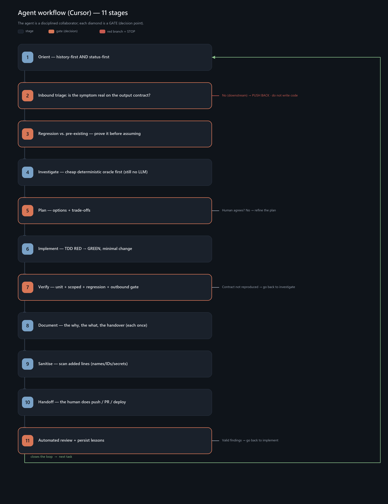

# Real Cursor working methodology

English counterpart of [`../metodologia/`](../metodologia/). Same content; Spanish filenames
there (`EJEMPLO_REAL.md`, `herramientas.md`) map here to `REAL_EXAMPLE.md` and `tools.md`.

How the **same** 11-stage course methodology (born in Claude Code) is applied using
**Cursor** as the agent. Not an ideal template: the production flow, with the adapted
surface (rules, skills, MCP, hooks).

| File | What it is |
|---|---|
| [`WORKFLOW.md`](./WORKFLOW.md) | The 11 stages + two-level memory, with Cursor tools. |
| [`REAL_EXAMPLE.md`](./REAL_EXAMPLE.md) | A concrete case (empty field) through the 11 stages. (Spanish: `EJEMPLO_REAL.md`.) |
| [`tools.md`](./tools.md) | Prevalence: CodeGraph, Serena, Playwright, skill `kg`, oracles. (Spanish: `herramientas.md`.) |
| [`machine-sync.md`](./machine-sync.md) | Ops runbook (tarball bring-up + evolution to S3); Cursor adaptation note at the top. |
| [`../../docs/synchro/s3-sync/README.md`](../../docs/synchro/s3-sync/README.md) | Shared engineering record on S3 (sync vs mount, roles, identity). |
| [`../../docs/KNOWLEDGE_GRAPH.md`](../../docs/KNOWLEDGE_GRAPH.md) | Ticket graph (graphify) — same scripts; skill `kg` in Cursor. |
| [`../../docs/ai-agents-code-methodology/CURSOR_ADAPTATION.md`](../../docs/ai-agents-code-methodology/CURSOR_ADAPTATION.md) | Full adaptation pack. |
| [`flow.png`](./flow.png) | Flow diagram. |

## Central idea

> **The agent is a disciplined collaborator, not an autopilot. Autonomy is earned decision-by-decision.**

Deterministic gates (contract, oracle, tests, sanitise, human on externals) — same as in Claude Code.

## Cursor surface (what lives where)

| Role | Claude Code | Cursor |
|---|---|---|
| Always-on orientation | `CLAUDE.md` | `AGENTS.md` + `.cursor/rules/` |
| Skills `/kg`, sanitise… | `~/.claude/skills/` | `.cursor/skills/` |
| MCP | `.mcp.json` / `claude mcp add` | `.cursor/mcp.json` |
| Hard gates | hooks + allowlist | `.cursor/hooks.json` |
| Plan gate | Plan mode | **Plan mode** |
| External handoff | often “the human / Cursor” | human (Cursor *is* the agent → rules/hooks block push) |

## How it fits with the tools

- **GSD** ([`../gsd/`](../gsd/)) — **Claude Code–only** plugin; in Cursor use Plan + skills.
- **Skill `kg`** — same graphify scripts; see pack `cursor/skills/kg`.
- **CodeGraph / Serena / Playwright** — MCP in `.cursor/mcp.json`.
- **Docker** — outbound in the deployed image (same).

## Portability

Starter kit: [`../../docs/ai-agents-code-methodology/`](../../docs/ai-agents-code-methodology/)
(`CURSOR_ADAPTATION.md` + `bootstrap-cursor-repo.ps1`).
