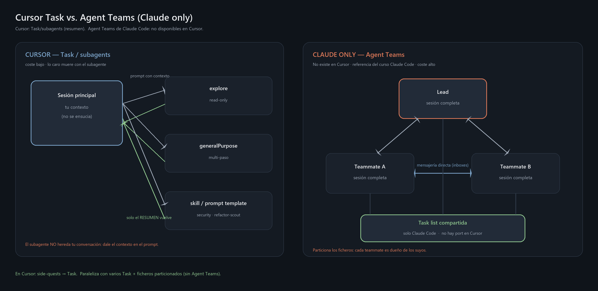

# Subagents (Task) en Cursor — y qué pasa con Agent Teams

Cómo escalar de *un* agente a *varios* en Cursor: la tool **Task** lanza subagentes con contexto
aislado. El diagrama original del curso sigue siendo útil conceptualmente:

> **Agent Teams de Claude Code (lead + teammates + inbox compartido) NO existen en Cursor.**
> Usa Task en paralelo + skills para roles. No intentes portar `CLAUDE_CODE_EXPERIMENTAL_AGENT_TEAMS`.

---

## 1. Subagentes con la tool `Task` (built-in)

| Tipo Cursor (aprox.) | Para qué |
|---|---|
| `explore` | Búsqueda read-only por el codebase |
| `generalPurpose` | Tareas multi-paso genéricas |
| `shell` | Trabajo centrado en comandos |
| Otros (ci-investigator, etc.) | Según el producto / skills del entorno |

La razón de ser es la misma: **aislamiento de contexto**. Un side-quest que lee 15 ficheros no debe
inundar tu hilo; el subagente muere y te deja un resumen.

Pídeselo en natural language (*"lanza un explore agent para localizar dónde se valida el token"*) o el
orquestador lo hará cuando encaje. Varios en **paralelo** si el trabajo es independiente.

## 2. “Subagentes custom” — cómo se adaptan

En Claude Code: `.claude/agents/<nombre>.md` con frontmatter (`tools`, `model`, …).

En Cursor **no hay ese fichero de agent type**. Opciones prácticas:

| Enfoque | Dónde | Cuándo |
|---|---|---|
| **Skill** con el procedimiento | `.cursor/skills/<rol>/SKILL.md` | Auto-selección por `description` |
| **Plantilla de prompt** para Task | Esta carpeta [`prompts/`](./prompts/) | Pegar al lanzar un Task |
| **Rule** que diga “antes de rename, Task con rol refactor-scout” | `.cursor/rules/` | Forzar el hábito |

Ejemplos portados:

- [`prompts/security-reviewer.md`](./prompts/security-reviewer.md)
- [`prompts/refactor-scout.md`](./prompts/refactor-scout.md)
- Skills equivalentes opcionales: copia el cuerpo a `.cursor/skills/…` si quieres auto-invoke.

**Gotcha:** el subagente **no hereda** tu conversación — dale contexto en el prompt de lanzamiento.

## 3. Agent Teams — no disponible

Todo lo de `teams/<team>/config.json`, inboxes, `teammateMode: tmux|iterm2` es **solo Claude Code**.

Sustituto razonable en Cursor:

1. Varios Task en paralelo con ficheros particionados (evita que dos editen el mismo file).
2. Un humano (o el agente principal) integra resultados.
3. Para greenfield multi-fase: Plan mode + skills de metodología (no GSD plugin).

## 4. ¿Task o “equipo”?

| | **Task / subagente** | **Agent team (Claude only)** |
|---|---|---|
| En Cursor | Sí | No |
| Contexto | Resumen al principal | Sesiones completas + mensajería |
| Coste | Menor | Alto |
| Ideal | Side-quests, scout, review | Trabajo paralelo con debate entre agents |

**Conexión metodología:** el `refactor-scout` codifica CodeGraph → Serena. GSD en Claude Code empaquetaba
roles similares como plugin; en Cursor los roles viven como skills/prompts ([`../gsd/`](../gsd/)).

El diagrama `agents.png` se regenera con `python render_agents.py` (fuente: `agents.mmd`).
Actualiza el título del diagrama si quieres decir “Cursor Task” en lugar de “Agent Teams”.
